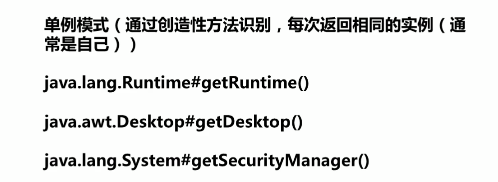

# 设计模式 
## **一、简单工厂设计模式**
  
## **二、工厂模式**
  
工厂模式优缺点：  
  _优点_：   
    1、在工厂模式中，用户只需要知道所要产品的具体工厂，无需关心产品的具体创建过程，甚至不需要知道具体产品的类名  
    2、在系统增加新产品时，我们只需要添加一个具体产品的类与相对性实现的工厂，无需对原工厂进行修改，很好的实现了开闭原则  
  _缺点_：  
    1、每次增加一个产品时，都需要增加相对应产品的具体类与对象实现工厂，使得系统中的类成倍增加，在一定的程度上增加了系统的复杂度同时也增加了系统具体类的依赖    
使用场景：  
    1、一个类不知道它所需要的对象的类。在工厂方法模式中，我们不需要知道具体的产品的类名，只需要知道创建它的具体工厂即可    
    2、一个类通过其子类来指定具体需要创建的对象。在程序运行时子类对象将覆盖父类对象，从而使得系统更容易扩展  
    3、将创建对象的任务委托给多个工厂类中的其中一个，客户端在使用时，可以无需关注是哪一个工厂子类创建产品子类，需要时再动态指定  
    4、在实际工作中，如果我们需要创建多种对象的时候，同时这些对象又有极大地相似之处可以考虑使用工厂设计模式  
Java源代码中使用到的工厂设计模式：    
## **三、抽象工厂模型**  
简介：在工厂方法模式中，我们使用一个工厂创建一个产品，也就是说一个具体的工厂对应一个具体的产品。但是有时候我们需要一个工厂
        提供多个产品对象，而不是单一的产品对象，这个时候我们就需要使用抽象工厂模式。  
在学习抽象工厂模式之前我们需要先理清楚两个概念：  
    * 1、产品等级结结构：产品的等级结构也就是产品的继承结构。例如一个为空调的抽象类，它有海尔、美的、格力等一系列的子类，
        那么这个抽象类空调和它的子类就构成一个产品等级结构  
        2、产品族：产品族是在抽象工厂模式中的。产品族指的是同一个工厂生产的，位于不同的产品结构中的一组产品，比如海尔工厂生产  
        海尔空调、海尔冰箱，那么海尔空调位于空调的产品族中，产品等级结构与产品族示例图如下：    
基本定义：  
        1、抽象工厂模式提供一组结构，用于创建相关依赖对象的家族，而不需要明确指定具体类。    
        2、抽象工厂允许客户端使用抽象的接口来创建一组相关的产品，而不需要关心实际产出的具体产品是什么，这样一来客户就可以从具体产品中被解耦  
    抽象工厂与工厂的使用情景
        两种设计模式主要区别在与产品，工厂模式是用来创建同一个产品不同类型的（店铺只买Pizza，Pizza分为不同的产品等级（肉的或者菜的））  
    但是抽象工厂是用来创建不同类的产品，比如说披萨店中还有可乐、牛奶等（分为不同的产品等级与不同的产品族）  
    一般来说，产品种类单一，适合使用工厂模式；如果有多个产品，且多个产品的产品等级不同，有多个产品族，且有多个产品等级，那么使用抽象工厂模式来进行创建是很合适的    
    抽象工厂的优缺点：  
        _优点_
            1、抽象工厂隔离了具体类的生成，客户端不需要知道什么需要被创建，所有具体工厂都实现了抽工厂中实现的接口，因此只需要改变具体
            工厂的实例，就可以在某种程度上改变整个系统的软件行为  
            2、当一个产品族中的多个对象被设计成一起工作时，它能够保证客户端始终只使用同一个产品族中的对象
        _缺点_  
            1、添加新的行为（添加产品族）时比价麻烦。如果需要添加一个新的产品族，那么需要更改接口及其下所有子类，这必然会带来极大的麻烦（这个缺点
            是我们工厂模式也有的一个缺点，但是我们不能只关注缺点，因为抽象工厂模式更多的是为了扩展我们的产品等级结构）
抽象工厂JDK源码位置：
抽象工厂脑图：  
  
## **四、单例设计模式**  
有时候我们只需要一个对象，如：线程池、对话框等等，对于这类对象只能有一个实例，如果我们制造出多个实例，就会有问题产生  
但是我们怎么保证一个类只有一个实例、并且能够访问呢？这里我们想到了全局变量，全局变量却是保证了该类可以随时被访问，但是它很难解决只有一个实例的问题，最好的方法是让该自身保存它的唯一实例    
    基本定义：  
        1、只有一个实例  
        2、必须要自行实例化  
        3、必须自行为整个系统提供访问点  
    单例模式JDK源码中的使用：  
## **五、建造者模式**
基本定义：建造者模式将一个复杂的对象的构建与表示分离，使得同样的构建过程可以创建不同的表示  
建造者模式构建复杂对象就像是生产一辆汽车，是一个一个组件，一个一个步骤创建出来的，它允许用户通过制定
的对象类型和内容创建他们，但是用户并不需要知道这个复杂对象是如何被创建的，它只需要明白通过这样做我可以得到一个完整的
复杂的对象实例。  
使用场景：  
1、需要生成产品的对象内部有复杂的内部结构，这些产品对象通常包含多个成员属性    
2、隔离复杂对象的创建和使用，并使得相同的创建过程可以创建不同的产品  
建造者模式脑图：  
JDK源码使用建造者模式：
总结：
1、建造者模式是将一个复杂对象的创建过程给封装起来，客户只需要知道可以利用对象名或者类型就能得到一个完整的对象实例，而不需要关心对象的具体创建过程  
2、建造者模式将对象的创建过程与对象本身隔离开，使得细节依赖于抽象，符合依赖倒置原则。可以使用相同的创建过程来创建不同的对象
  
    
    